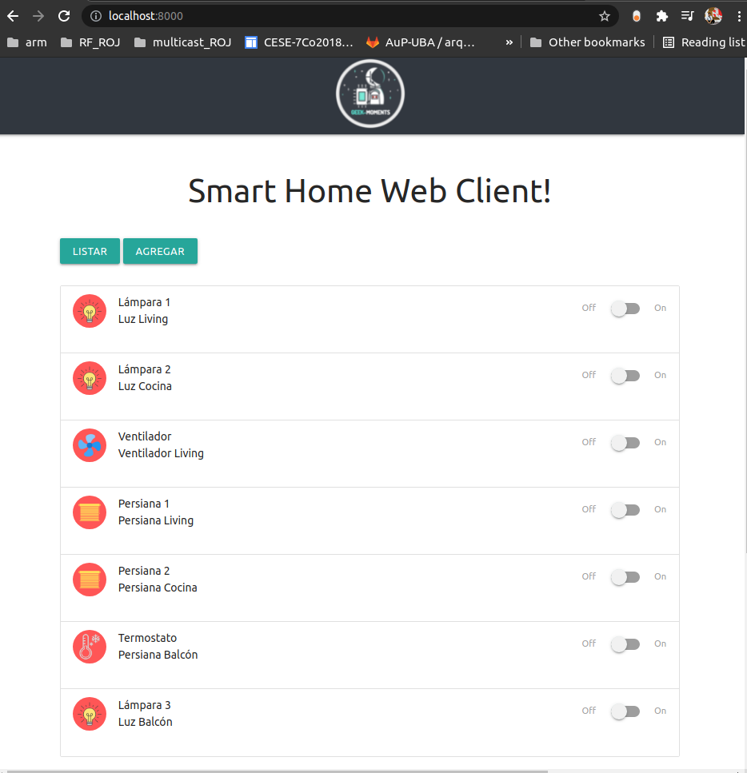
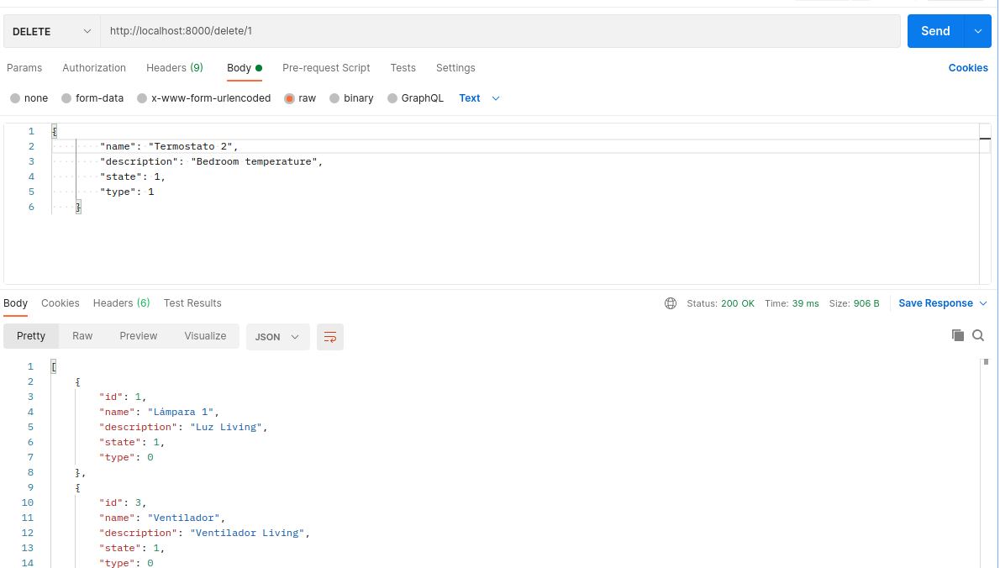

<a href="https://www.gotoiot.com/">
    
</a>

Web App Smart Home | DAW - MIoT
=======================

*Trabajo práctico FInal - César Cruz*
```
Lo implementado esta basado en el repositorio original app-fullstack-base 
del curso de desarrollo de aplicaciones I
```
##Descripción

Este proyecto es una aplicación web fullstack que se ejecuta sobre el ecosistema `Docker`. Está compuesta por un compilador de `TypeScript` que te permite utilizar este superset de JavaScript para poder programar un `cliente web`. También tiene un servicio en `NodeJS` que te permite ejecutar código en backend y al mismo tiempo disponibilizar el código del cliente web para interactar con el servicio. Además tiene una `base de datos` MySQL que puede interactuar con el backend para guardar y consultar datos, y de manera adicional trae un `administrador` de base de datos para poder administrar la base en caso que lo necesites.

La aplicación IoT de base que viene con este proyecto se encarga de crear una tabla llamada `Devices` en la base de datos, y la idea es que vos puedas desarrollar el código de backend y frontend que te permita controlar desde el navegador el estado de los devices de un hogar inteligente - *como pueden ser luces, TVs, ventiladores, persianas, enchufes y otros* - y almacenar los estados de cada uno en la base de datos. 

Realizando estas tareas vas a a tener una aplicación fullstack IoT del mundo real que utiliza tecnologías actuales en la que un backend es capaz de interactuar con una DB para cumplir con las peticiones de control que se le mandan desde el cliente web.

En esta imagen podés ver una posible implementación del cliente web que controla los artefactos del hogar.


## Preparación del proyecto base
### Instalar las dependencias

Para correr este proyecto es necesario que instales `Docker` y `Docker Compose`.

En [este artículo](https://www.gotoiot.com/pages/articles/docker_installation_linux/) publicado en nuestra web están los detalles para instalar Docker y Docker Compose en una máquina Linux. Si querés instalar ambas herramientas en una Raspberry Pi podés seguir [este artículo](https://www.gotoiot.com/pages/articles/rpi_docker_installation) de nuestra web que te muestra todos los pasos necesarios.

En caso que quieras instalar las herramientas en otra plataforma o tengas algún incoveniente, podes leer la documentación oficial de [Docker](https://docs.docker.com/get-docker/) y también la de [Docker Compose](https://docs.docker.com/compose/install/).

Continua con la descarga del código cuando tengas las dependencias instaladas y funcionando.

### Descargar el código

Para descargar el código, lo más conveniente es que realices un `fork` de este proyecto a tu cuenta personal haciendo click en [este link](https://github.com/gotoiot/app-fullstack-base/fork). Una vez que ya tengas el fork a tu cuenta, descargalo con este comando (acordate de poner tu usuario en el link):

```
git clone https://github.com/USER/app-fullstack-base.git
```

### Ejecutar la aplicación

Para ejecutar la aplicación tenes que correr el comando `docker-compose up` desde la raíz del proyecto. Este comando va a descargar las imágenes de Docker de node, de typescript, de la base datos y del admin de la DB, y luego ponerlas en funcionamiento.

Para acceder al cliente web ingresa a a la URL [http://localhost:8000/](http://localhost:8000/) y para acceder al admin de la DB accedé a [localhost:8001/](http://localhost:8001/).
 

### Arquitectura de la aplicación

Como ya pudiste ver, la aplicación se ejecuta sobre el ecosistema Docker, y en esta imagen podés ver el diagrama de arquitectura.


## Desarrollo frontend
Se hizo uso de etiquetas de materialize para dar mayor orden a la distribución de objetos en la web. Etiquetas de header, etiquetas de imagen y lectura de parametros json para personalizar los dispositivos.

Se implementó los ejercicios propuestos siguendo el aprendizaje sugerido y se hicieron los cambios necesarios para mejorar la distribución y funcionalidad.
Se Capturaron los valores y eventos por consola para verficicar funcionamiento
## Desarrollo backend 🛠️

 
Se dió un mayor orden al codigo separando la solicitud de dispositivos del archivo index principal, logrando tener un mayor orden, en adelante se obtará por este modo de trabajo, haciendo invocaciones desde index.js , con la siguiente estructura de archivos
```
->backend
    ->routes
        devices.js
    index.js
    datos.json
   ```

 
Se implementó metodos PUT PUSH DELETE y PUT, para actualizar los valores de json
Las pruebas de los métodos se realizaron con POSTMAN, con el que se pudo validar la funcionalidad y cambios.
```
router.get('/devices',
router.get('/devices/:id'
router.post('/devices/',
router.post('/new',
router.delete('/delete/:id',
router.put('/update/:id'

   ```
No se altera el cambio final del documento json para poder mantener el ejemlo.

Se validaron los valores capturados para modificar valores json.

###Pruebas con POSTMAN




## Pendientes
No se pudo conectar el los métodos implementados con el frontend para poder agregar dispositivos por formularios.

No se implementó tareas adicionales con Ajax.

El boton Agregar no tiene funcionalidad.
## Licencia 📄

Este proyecto está bajo Licencia ([MIT](https://choosealicense.com/licenses/mit/)). Podés ver el archivo [LICENSE.md](LICENSE.md) para más detalles sobre el uso de este material.

---

**Copyright © Goto IoT 2021** ⌨️ [**Website**](https://www.gotoiot.com) ⌨️ [**Group**](https://groups.google.com/g/gotoiot) ⌨️ [**Github**](https://www.github.com/gotoiot) ⌨️ [**Twitter**](https://www.twitter.com/gotoiot) ⌨️ [**Wiki**](https://github.com/gotoiot/doc/wiki)
